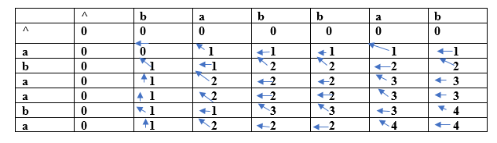

- 2 strings will be given
- when 2 char match then fine
- if not 2 cases
- string 1++ string2
- string1 string2++

when both doesnot match 
reduce 1 from one of string at a time and add the sum

aaddd/aaddu
max(aaddd/aadd  aadd/aaddu)
